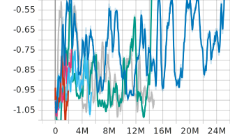
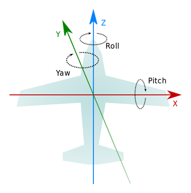

# 戦闘機ゲーム 強化学習プログラム

制作中の [戦闘機ゲーム](https://github.com/s059ff/ZephyrEngine/tree/master/application02) の強化学習プログラム

##### ゲームのスクリーンショット


##### デモ動画

###### 人間操作

<video src="https://github.com/s059ff/programming-python-openai-gym/raw/main/doc/videos/app.exe%202024-09-02%2018-32-26.mp4" controls="true"></video>

###### COM 操作

<video src="https://github.com/s059ff/programming-python-openai-gym/raw/main/doc/videos/app.exe%202024-09-02%2018-46-26.mp4" controls="true"></video>

##### 動作イメージ


- ゲームプロセスと学習プロセス間の通信は, ソケット通信を使用.
- 学習プロセス内でゲームプロセス起動
- ゲームプロセスはコマンドライン引数 `--mode` で動作モード (play, demo, training, evaluation) を指定可能
  - play: 自機を 人間 が操作
  - demo: 自機を COM が操作 (ルールベース AI)
  - training/evaluation: 自機をソケット通信で受け取った信号で操作
    - training: レンダリング処理は, 学習に不要なためスキップする
  - 敵機は常に COM 操作

##### COM 操作 (ルールベース AI) について

1. 高度が低い
   → 高度を上げる
2. 戦闘エリア境界に近い
   → 戦闘エリア中央に引き返す
3. ミサイルに追尾されている
   → 回避運動
4. 敵機に追尾されている (ロックオンされている)
   → 回避運動
5. 1~4 どれにも該当しない
   → ターゲットの未来予測位置に向かって旋回+移動

**ターゲットの選定**

- ランダムに選択
- ターゲットが撃墜されると再度ランダムに選択

**攻撃ルーチン**

- 敵機をロックしている場合, 0.001 (適当) の確率でミサイルを発射
- 機関砲の射程内に敵機がいて, 命中確率が高い場合, 機関砲を発射

## 環境構築

### ゲームのビルド

https://github.com/s059ff/ZephyrEngine/ の `application02` プロジェクトをビルド

### Python 環境構築

`setup.ps1` を参照

### 動作確認済み環境

- Dell Precision Tower 5810
- Windows11 Pro
- 64GB RAM
- Visual Studio Community 2022
- conda: `env_20240901.yml`
  - stable-baselines3=2.3.2

## Environment の設計

- 自機 x1, 敵機 x1, 味方機なし
- 1 フレーム = 1 ステップ = (1/60 秒)
- 1 エピソード: 以下のいずれかの条件に該当したとき
  - 自機または敵機が撃墜された (耐久値が 0 になった)
  - シーン開始時から 3600 フレーム(1 分) が経過した

### Observation

- 自機
  - 耐久値
  - 地面からの高さ
  - エンジン推力
  - 位置, 角度, 速度
- 敵機
  - 耐久値
  - 位置, 角度, 速度
- ミサイル (自身を追尾しているものが存在する場合)
  - 位置, 角度, 速度

#### 例

```json
{
  "episode_done": false,
  "player": {
    // 自機
    "armor_delta": 0.0, // 耐久値変化量 (≦0)
    "altitude": 0.156509787, // 地面からの高さ [0, 1]
    "engine_power": 0.5, // エンジン推力 [0, 1]
    "position": [
      // 位置 (ワールド座標系 xyz) [-1, 1]
      0.0, 0.199999988, -0.199999988
    ],
    "rotation": [
      // 角度 (クォータニオン, ワールド座標系, 正規化適用 xyzw) [-1, 1]
      0.0, 0.0, 0.0, 1.0
    ],
    "velocity": [
      // 速度 (ワールド座標系 xyz) およそ[-1, 1]
      0.0, 0.0, 0.0
    ]
  },
  "target": {
    // 敵機
    "armor_delta": 0.0, // 耐久値変化量 (≦0)
    "position": [
      // 位置 (ワールド座標系 xyz) [-1, 1]
      0.0, 0.199999988, 0.199999988
    ],
    "rotation": [
      // 角度 (クォータニオン, ワールド座標系, 正規化適用 xyzw) [-1, 1]
      -0.426730573, 0.723997235, 0.5117876, -0.178332448
    ],
    "velocity": [
      // 速度 (ワールド座標系 xyz) およそ[-1, 1]
      0.0, 0.0, 0.0
    ]
  },
  "threat_missile": {
    // 自機を追尾しているミサイル (存在しない場合はすべて0)
    "position": [
      // 位置 (ワールド座標系 xyz) [-1, 1]
      0.0, 0.0, 0.0
    ],
    "rotation": [
      // 角度 (クォータニオン, ワールド座標系, 正規化適用 xyzw) [-1, 1]
      0.0, 0.0, 0.0, 1.0
    ],
    "velocity": [
      // 速度 (ワールド座標系 xyz) およそ[-1, 1]
      0.0, 0.0, 0.0
    ]
  }
}
```

#### ダメージ量について

| イベント                     | ダメージ量 |
| ---------------------------- | ---------- |
| 機関砲の弾が衝突             | 0.05       |
| ミサイルが衝突               | 0.5        |
| 地面に衝突 or エリア外に出る | 1.0        |

耐久値の初期値は 1.0 のため, 地面に衝突ないしエリア外に出ると即死.

### Action

- 自機の操作
  - ロール操作
  - ピッチ操作
  - ヨー操作
  - スロットルレバー操作
  - ミサイル発射確率
  - 機関砲発射確率

###### 備考

- ミサイルはリロードに時間がかかるため, リロードが完了するまでは発射できない.
- ミサイルと機関砲の弾数は無限

#### 例

```json
{
  "roll_input": 0.5,
  "pitch_input": 0.5,
  "yaw_input": 0.0,
  "throttle_input": 0.5,
  "missile_launch_input": 0.0,
  "gun_fire_input": 0.0
}
```

### Reward

$$
reward := (自機の耐久値変化量) - (敵機の耐久値変化量)
$$

```python
rew = 0.0
rew += obj["player"]["armor_delta"]
rew += -obj["target"]["armor_delta"]
```

## 強化学習のアルゴリズム

- PPO
- MlpPolicy
  - 状態空間, 行動空間 ともに 連続値
- ネットワークアーキテクチャ
  - (デフォルトのまま)
    ```
    ActorCriticPolicy(
      (features_extractor): FlattenExtractor(
        (flatten): Flatten(start_dim=1, end_dim=-1)
      )
      (pi_features_extractor): FlattenExtractor(
        (flatten): Flatten(start_dim=1, end_dim=-1)
      )
      (vf_features_extractor): FlattenExtractor(
        (flatten): Flatten(start_dim=1, end_dim=-1)
      )
      (mlp_extractor): MlpExtractor(
        (policy_net): Sequential(
          (0): Linear(in_features=32, out_features=64, bias=True)
          (1): Tanh()
          (2): Linear(in_features=64, out_features=64, bias=True)
          (3): Tanh()
        )
        (value_net): Sequential(
          (0): Linear(in_features=32, out_features=64, bias=True)
          (1): Tanh()
          (2): Linear(in_features=64, out_features=64, bias=True)
          (3): Tanh()
        )
      )
      (action_net): Linear(in_features=64, out_features=6, bias=True)
      (value_net): Linear(in_features=64, out_features=1, bias=True)
    )
    ```
- 学習係数: 0.995
  - 行動を開始してから, 報酬に反映されるまでの期間が一般的な強化学習より長い?
    そのため, デフォルトの学習係数 0.99 より少し大きい値にした.

## 学習結果

**1エピソード中の平均報酬 (rollout/ep_len_mean)**



- 何回かトライしてみたが, いずれも収束していない.
- 正の報酬がなく, 負の報酬しか得られていない.
  → 自機の攻撃が全くヒットしていないと思われる.

これ以外のグラフについては doc/charts/ 以下を参照

**学習済みのモデル評価**

* deterministic=false

<video src="https://github.com/s059ff/programming-python-openai-gym/raw/main/doc/videos/app.exe%202024-09-03%2004-14-01" controls="true"></video>

* deterministic=true

<video src="https://github.com/s059ff/programming-python-openai-gym/raw/main/doc/videos/app.exe%202024-09-03%2004-16-07.mp4" controls="true"></video>

## 今後の取り組み

- ニューラルネットワークへの入力値を見直す.
  - 座標は Vector3 でいいとして, 角度は Quaternion でよいのか?
  - 今回, 座標は絶対値を用いたが, 相対値のほうが良いのではないか? (自機から見た敵機の相対位置)
  - ViZDOOM[^1] (DOOM の強化学習コンテスト) では画面画像を入力している. 画面画像を入力するほうがよいのか?
- 報酬の設計
- 割引率の設計
- 環境の設計
  - COM が強すぎて, エージェントが一度も勝てず, 学習が進まない?
  - 最初はもっと弱い COM にして, 徐々に強くするべき? (カリキュラム学習)
- アルゴリズムの選択
  - PPO 以外は試していないため, 他も試す.

(以下の項目は対応済み)

- ゲームのバグの修正
  - socket 通信が正しく行われているか確認する
    →挙動が怪しかったので, 再度実装しなおした. 1日中回していてもクラッシュしなくなったので, とりあえずよしとする.
  - ゲームがメモリリークを起こしていて, 時間経過でクラッシュする
    →メモリリークを起こしている個所を特定して修正. 1日中回していてもメモリ使用量に大きな変化はなくなったので, よしとする.

[^1]: https://vizdoom.cs.put.edu.pl/

---

##### Tips

###### 飛行機の回転



注: 左手座標系
